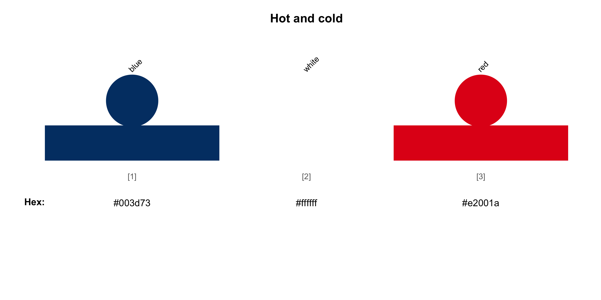
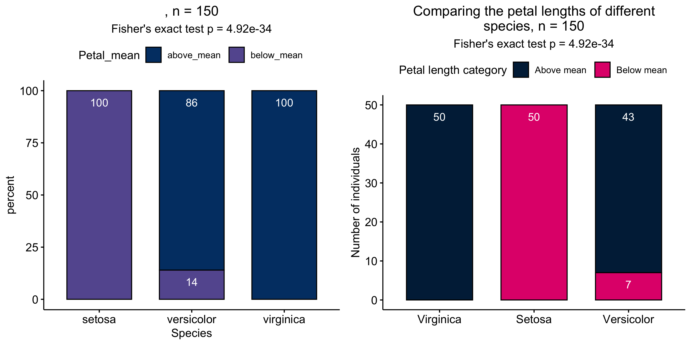
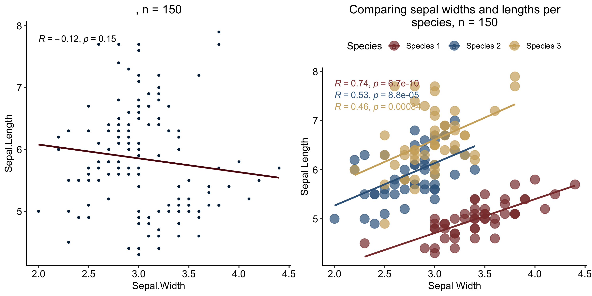

<!-- README.md is generated from README.Rmd. Please edit that file -->

# ggAU - ggplot2 themes for Aarhus University

<!-- badges: start -->

[](https://github.com/juditkisistok/ggAU/actions/workflows/check-standard.yaml)
[](https://codecov.io/gh/juditkisistok/ggAU)
<!-- badges: end -->

The goal of ggAU is to simplify the process of creating
publication-ready visualizations that follow the [Aarhus University
color
scheme](https://medarbejdere.au.dk/en/administration/communication/guidelines/guidelinesforcolours).
It also includes a color scheme inspired by the [TRACERx
publications](https://www.nature.com/collections/haffgaicaf).

## Installation

You can install the development version of ggAU from
[GitHub](https://github.com/) with:

``` r
# install.packages("devtools")
devtools::install_github("juditkisistok/ggAU")
```

## Available color palettes

``` r
library(ggAU)
unikn::seecol(au_color_palette(style = "light"), main = "Light", 
              grid = F, rgb = F)
```


``` r
unikn::seecol(au_color_palette(style = "dark"), main = "Dark", 
              grid = F, rgb = F)
```


``` r
unikn::seecol(au_color_palette(style = "hotandcold"), main = "Hot and cold", 
              grid = F, rgb = F)
```



``` r
unikn::seecol(au_color_palette(style = "hotandcold_dark"), main = "Hot and cold (dark)", 
              grid = F, rgb = F)
```


``` r
unikn::seecol(au_color_palette(style = "tracerx"), main = "TRACERx", 
              grid = F, rgb = F)
```


# Examples

The `scale_fill_au` and `scale_color_au` functions allow you to apply
the pre-defined color palettes.

The default color scheme is `light` and the default variable type is
continuous. You can add `discrete = T` for categorical variable color
schemes.

``` r
iris_df = dplyr::summarize(dplyr::group_by(iris, Species), 
                           `Mean petal width` = mean(Petal.Width))

light_plot_fill = ggplot2::ggplot(iris_df, ggplot2::aes(x = Species, 
                                      y = `Mean petal width`, fill = Species)) +
  ggplot2::geom_bar(stat = "identity") +
  ggpubr::theme_pubr() +
  scale_fill_au(discrete = T)

dark_plot_fill = ggplot2::ggplot(iris_df, ggplot2::aes(x = Species, 
                                     y = `Mean petal width`, fill = Species)) +
  ggplot2::geom_bar(stat = "identity") +
  ggpubr::theme_pubr() +
  scale_fill_au(discrete = T, style = "dark")

cowplot::plot_grid(light_plot_fill, dark_plot_fill)
```


It is also possible to define your own mix of colors - you can retrieve
a vector of AU hex codes by color name.

``` r
my_custom_style = c("blue", "yellow", "red")

ggplot2::ggplot(iris_df, ggplot2::aes(x = Species, 
                                      y = `Mean petal width`, fill = Species)) +
  ggplot2::geom_bar(stat = "identity") +
  ggpubr::theme_pubr() +
  scale_fill_au(discrete = T, style = "custom", colors = my_custom_style)
```


The continuous fill scale works in a similar way, both with the built-in
and custom color schemes.

``` r
dummy_data = expand.grid(x = paste0("var_", seq(1, 10)),
                          y = paste0("var_", seq(11, 20)))
dummy_data$z = runif(100, -1, 1)

cont_fill_1 = ggplot2::ggplot(dummy_data, ggplot2::aes(x, y, fill = z)) +
  ggplot2::geom_tile() +
  ggpubr::theme_pubr() +
  scale_fill_au(style = "hotandcold")

cont_fill_2 = ggplot2::ggplot(dummy_data, ggplot2::aes(x, y, fill= z)) +
  ggplot2::geom_tile() +
  ggpubr::theme_pubr() +
  scale_fill_au(style = "custom", colors = c("yellow", "white", "darkblue"))

cowplot::plot_grid(cont_fill_1, cont_fill_2)
```


The color aesthetic can be changed in a similar way, using
`scale_color_au`.

``` r
discrete_cols = ggplot2::ggplot(iris, ggplot2::aes(x = Petal.Width, y = Petal.Length, color = Species)) +
  ggplot2::geom_point(size = 5, alpha = 0.3) +
  ggpubr::theme_pubr() +
  scale_color_au(discrete = T) +
  ggplot2::ggtitle("Built-in discrete color scale") +
  ggplot2::theme(plot.title = ggplot2::element_text(hjust = 0.5))

discrete_custom = ggplot2::ggplot(iris, ggplot2::aes(x = Petal.Width, y = Petal.Length, color = Species)) +
  ggplot2::geom_point(size = 5, alpha = 0.3) +
  ggpubr::theme_pubr() +
  scale_color_au(discrete = T, style = "custom", colors = c("yellow", "magenta", "darkblue")) +
  ggplot2::ggtitle("Custom discrete color scale") +
  ggplot2::theme(plot.title = ggplot2::element_text(hjust = 0.5))

cont_cols = ggplot2::ggplot(iris, ggplot2::aes(x = Petal.Width, y = Petal.Length, color = Petal.Length)) +
  ggplot2::geom_point(size = 5, alpha = 0.3) +
  ggpubr::theme_pubr() +
  scale_color_au(discrete = F, style = "hotandcold") +
  ggplot2::ggtitle("Built-in continuous color scale") +
  ggplot2::theme(plot.title = ggplot2::element_text(hjust = 0.5))

cont_custom = ggplot2::ggplot(iris, ggplot2::aes(x = Petal.Width, y = Petal.Length, color = Petal.Length)) +
  ggplot2::geom_point(size = 5, alpha = 0.3) +
  ggpubr::theme_pubr() +
  scale_color_au(discrete = F, style = "custom", colors = c("darkblue", "yellow", "magenta")) +
  ggplot2::ggtitle("Custom continuous color scale") +
  ggplot2::theme(plot.title = ggplot2::element_text(hjust = 0.5))

cowplot::plot_grid(discrete_cols, discrete_custom, cont_cols, cont_custom)
```


# Built-in plots

Additionally to the color schemes, ggAU also includes commonly used
visualization types with pre-applied AU styles.

## Violinplotter

The function has many customization options, however, specifying `data`,
`x_val` and `y_val` is enough for getting a basic plot up and running.

``` r
minimal = violinplotter(data = iris, x_val =  "Species", y_val = "Petal.Width",
                        title = "Minimal example")

minimal_filtered = violinplotter(data = iris, x_val =  "Species", y_val = "Petal.Width",
                                 filter = T, filter_col = "Species", filter_val = c("setosa", "virginica"),
                                 title = "Minimal filtered example")

full_custom = violinplotter(data = iris, x_val =  "Species", y_val = "Petal.Width", 
                            x_lab = "Species", y_lab = "Petal width", 
                            title = "Fully customized example",
                            filter = F, filter_col = NA, filter_val = NA,
                            comp_vec = list(c("setosa", "virginica"), 
                                            c("setosa", "versicolor"), 
                                            c("virginica", "versicolor")),
                            col_style = "custom",  fill_style = "custom", 
                            col_vec = c("red", "blue", "green"), 
                            fill_vec = c("red", "blue", "green"),
                            display_n = F)

cowplot::plot_grid(minimal, minimal_filtered, full_custom, nrow = 1)
```


## Barplotter

This function creates a bar plot and displays the Fisher’s test p-value
as a subtitle. Similarly to `violinplotter`, many customization options
are available, but specifying `data`, `x_lab` and `y_lab` is sufficient
for creating a basic plot.

``` r
# modifying the iris data to include two categorical variables
iris = iris %>%
  dplyr::mutate(Petal_mean = ifelse(Petal.Length > mean(Petal.Length), "above_mean", "below_mean"))

minimal_barplot = barplotter(data = iris, x_val = "Species", y_val = "Petal_mean",
                             labcol = "white")

full_custom_barplot = barplotter(data = iris, x_val = "Species", y_val = "Petal_mean",
                                 order = c("virginica", "setosa", "versicolor"),
                                 scale_labs = c("Virginica", "Setosa", "Versicolor"),
                                 pct = FALSE, style = "custom", colors = c("darkblue", "magenta"),
                                 y_lab = "Number of individuals", x_lab = "",
                                 title = "Comparing the petal lengths of different species",
                                 labcol = "white", legend_lab = "Petal length category",
                                 labels = c("Above mean", "Below mean")
                                 )

cowplot::plot_grid(minimal_barplot, full_custom_barplot)
```



## Scatterplotter

This function creates a scatterplot, fits a . Similarly to
`violinplotter`, many customization options are available, but
specifying `data`, `x_lab` and `y_lab` is sufficient for creating a
basic plot.

``` r
minimal_scatterplot = scatterplotter(iris, "Sepal.Width", "Sepal.Length",
                                     linecolor = au_colors("darkred"), 
                                     pointcolor = au_colors("darkblue"),
                                     fit = "single")

full_custom_scatterplot = scatterplotter(iris, "Sepal.Width", "Sepal.Length", 
                                         col_val = "Species", style = "custom",
                                         colors = c("trxred", "trxblue", "trxyellow"),
                                         y_lab = "Sepal Length", x_lab = "Sepal Width", 
                                         title = "Comparing sepal widths and lengths per species", 
                                         fit = "grouped", corr_method = "pearson", 
                                         alternative = "two.sided", fit_method = "lm",
                                         se = FALSE, formula = "y ~ x",
                                         legend_lab = "Species", discrete = TRUE,
                                         labels = c("Species 1", "Species 2", "Species 3"))

cowplot::plot_grid(minimal_scatterplot, full_custom_scatterplot)
```


