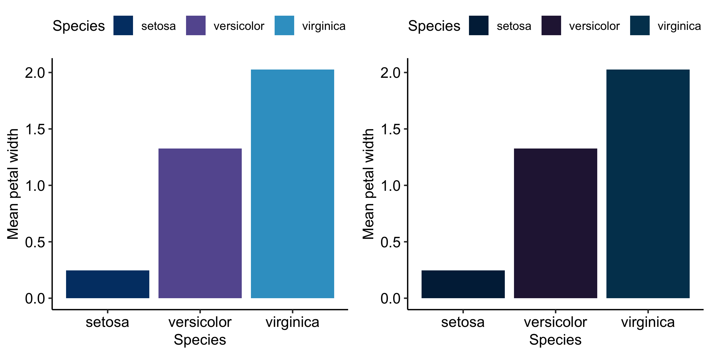

<!-- README.md is generated from README.Rmd. Please edit that file -->

# ggAU - ggplot2 themes for Aarhus University

<!-- badges: start -->
<!-- badges: end -->

The goal of ggAU is to simplify the process of creating
publication-ready visualizations that follow the [Aarhus University
color
scheme](https://medarbejdere.au.dk/en/administration/communication/guidelines/guidelinesforcolours).

## Installation

You can install the development version of ggAU from
[GitHub](https://github.com/) with:

``` r
# install.packages("devtools")
devtools::install_github("juditkisistok/ggAU")
```

## Available color palettes

``` r
library(ggAU)
unikn::seecol(au_color_palette(style = "light"), main = "Light", 
              grid = F, rgb = F)
```


``` r
unikn::seecol(au_color_palette(style = "dark"), main = "Dark", 
              grid = F, rgb = F)
```


``` r
unikn::seecol(au_color_palette(style = "hotandcold"), main = "Hot and cold", 
              grid = F, rgb = F)
```


``` r
unikn::seecol(au_color_palette(style = "hotandcold_dark"), main = "Hot and cold (dark)", 
              grid = F, rgb = F)
```


# Examples

The `scale_fill_au` and `scale_color_au` functions allow you to apply
the pre-defined color palettes.

The default color scheme is `light` and the default variable type is
continuous. You can add `discrete = T` for categorical variable color
schemes.

``` r
iris_df = dplyr::summarize(dplyr::group_by(iris, Species), 
                           `Mean petal width` = mean(Petal.Width))

light_plot_fill = ggplot2::ggplot(iris_df, ggplot2::aes(x = Species, 
                                      y = `Mean petal width`, fill = Species)) +
  ggplot2::geom_bar(stat = "identity") +
  ggpubr::theme_pubr() +
  scale_fill_au(discrete = T)

dark_plot_fill = ggplot2::ggplot(iris_df, ggplot2::aes(x = Species, 
                                     y = `Mean petal width`, fill = Species)) +
  ggplot2::geom_bar(stat = "identity") +
  ggpubr::theme_pubr() +
  scale_fill_au(discrete = T, style = "dark")

cowplot::plot_grid(light_plot_fill, dark_plot_fill)
```



It is also possible to define your own mix of colors - you can retrieve
a vector of hex codes by color name.

``` r
my_custom_style = c("blue", "yellow", "red")

ggplot2::ggplot(iris_df, ggplot2::aes(x = Species, 
                                      y = `Mean petal width`, fill = Species)) +
  ggplot2::geom_bar(stat = "identity") +
  ggpubr::theme_pubr() +
  scale_fill_au(discrete = T, style = "custom", colors = my_custom_style)
```


